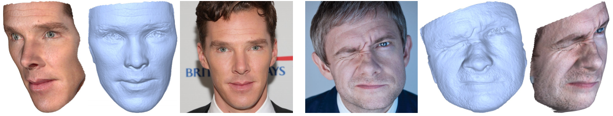

# Unrestricted Facial Geometry Reconstruction Using Image-to-Image Translation
[[Arxiv]](https://arxiv.org/pdf/1703.10131.pdf) [[Video]](https://www.youtube.com/watch?v=6lUdSVcBB-k)

Evaluation code for Unrestricted Facial Geometry Reconstruction Using Image-to-Image Translation. Given a single image, the code outputs the reconstructed mesh.



## Setup & Usage
- Make sure you have <a href="http://torch.ch/docs/getting-started.html">Torch</a> installed on your machine.

- Download the <a href="https://drive.google.com/open?id=0B1j6t9f_-lyrRGhOSnJyVXhvaEU">model files</a> and extract them into the ```models``` directroy.

- To use our code, simply run the ```runme.m``` script in Matlab.

## Citation
If you use this code for your research, please cite our paper <a href="https://arxiv.org/pdf/1703.10131.pdf">Unrestricted Facial Geometry Reconstruction Using Image-to-Image Translation</a>:

```
@article{sela2017unrestricted,
  title={Unrestricted Facial Geometry Reconstruction Using Image-to-Image Translation},
  author={Sela, Matan and Richardson, Elad and Kimmel, Ron},
  journal={arxiv},
  year={2017}
}
```
